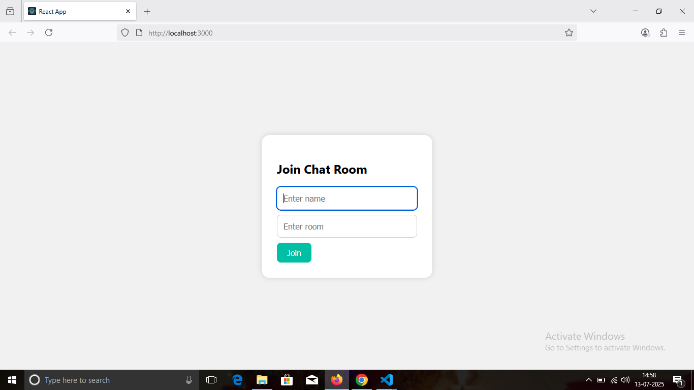
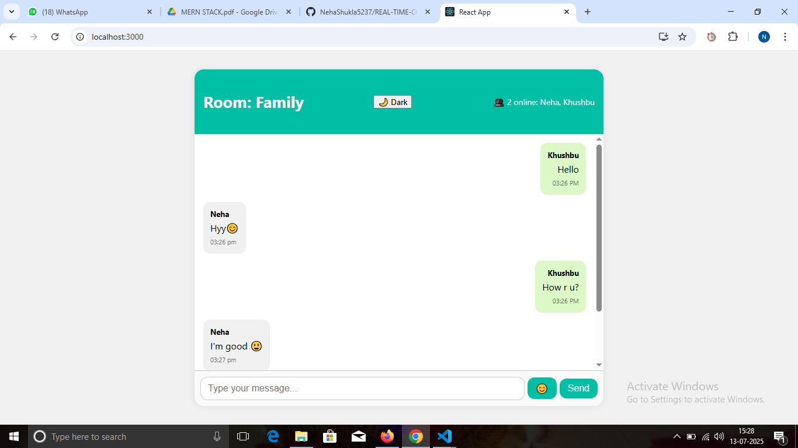
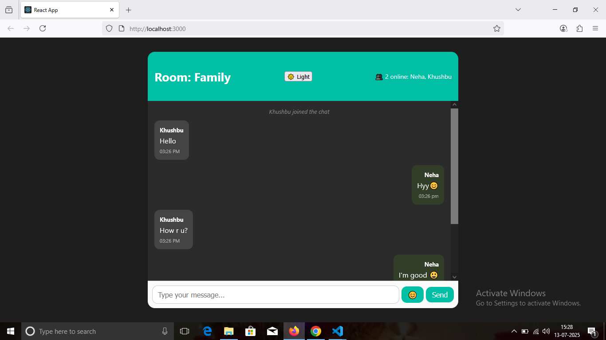

# 💬 Real-Time Chat App (React + Socket.IO)

A modern, responsive, and real-time chat application built using **React (frontend)** and **Node.js + Socket.IO (backend)**. Supports emoji messaging, dark mode, user typing indicators, and multi-room chat — inspired by WhatsApp and Instagram.

---

**Company:** CODTECH IT SOLUTIONS  
**Name:** Neha Shukla  
**Intern ID:** CT06DF671  
**Domain:** MERN Stack Web Development  
**Duration:** 6 Weeks  
**Mentor:** Neela Santosh Kumar  

---

# 🚀 Real-Time Chat Application with Socket.IO

**Develop a full-featured messaging platform that enables real-time communication between users. The application includes:**

✅ Room-based chat with live updates  
✅ Emoji picker integration  
✅ Typing indicator when users are typing  
✅ Toggle between Dark and Light modes  
✅ Online user tracking  
✅ Instant WebSocket-based message delivery  

---

## 🧩 Features

| Feature              | Description                                               |
| -------------------- | --------------------------------------------------------- |
| 💬 Real-Time Chat    | Messages appear instantly using WebSockets                |
| 🧑‍🤝‍🧑 Room Chat      | Users can join separate rooms using a name + room ID       |
| ✍️ Typing Indicator  | Shows when someone is typing                              |
| 😊 Emoji Support     | Insert emojis directly using Emoji Picker                 |
| 🌙 Dark Mode         | Switch between Light and Dark modes                       |
| 👥 Online Users      | See the number of people currently in the room            |
| 📱 Responsive Design | Works on mobile, tablet, and desktop                      |

---

## 📁 Folder Structure

```
chat-app/
├── backend/                   # Node.js + Socket.IO backend
│   ├── server.js
│   └── package.json
│
├── frontend/                  # React frontend
│   ├── src/
│   │   ├── App.js
│   │   ├── App.css
│   │   └── index.js
│   ├── public/
│   │   └── index.html
│   ├── package.json
│   └── ...
│
├── step1.png                  # Screenshot 1: Join screen
├── step2.png                  # Screenshot 2: First browser
├── step3.png                  # Screenshot 3: Second browser
└── README.md
```

---

## 🚀 How to Run

### 🔹 Backend Setup (Port: 5000)

```bash
cd backend
npm install
node server.js
```

### 🔹 Frontend Setup (Port: 3000)

```bash
cd frontend
npm install
npm start
```

> 🔁 Make sure both servers are running for full functionality.

---

## 📸 Screenshots

### 🔹 Join Chat Room  


---

### 🔹 Chat in First Browser  


---

### 🔹 Chat in Second Browser  


---

## 🛠 Tech Stack

* **Frontend:** React, CSS, Emoji-picker-react  
* **Backend:** Node.js, Express, Socket.IO  
* **WebSocket Protocol:** Real-time bidirectional event-based communication

---

## 👩‍💻 Author

* **Name:** Neha Shukla  
* **Project:** Real-Time Chat Application  
* **GitHub:** [@NehaShukla5237](https://github.com/NehaShukla5237)

---

## ✨ License

This project is open-source and free to use under the [MIT License](LICENSE).
